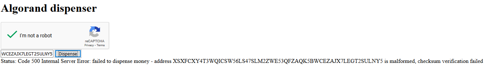

## Account

#### Create random adress


With this experiment, we try to send a transaction to a malformed account address.

For this purpose we had previously generated the following well-formed account. The account was fund with 100 Algos.

```
Account address: XSXFCXY4T3WQICSW56LS47SLM2ZWE53QFZAQK5BWCEZAJX7LEGT2SULNYY
```

We also have this malformed address. This is a random address.

```
Address: XSXFCXY4T3WQICSW56LS47SLM2ZWE53QFZAQK5BWCEZAJX7LEGT2SULNY5
```

When we try to fund this address using the algorand faucet located [here](https://bank.testnet.algorand.network/), we obtain an error message as shown below.



Using the javascript client deployed [here](), we sent a transaction from the first (well-formed) address to the malformed address. 

The transaction fails and no Algos are send to the receiver, but the sender needs to pay fees.

We did the same experiment using the goal command line tool.

```
algorand@b6c2df144b70:/opt/algorand/node$ goal clerk send --from=XSXFCXY4T3WQICSW56LS47SLM2ZWE53QFZAQK5BWCEZAJX7LEGT2SULNYY --to=XSXFCXY4T3WQICSW56LS47SLM
2ZWE53QFZAQK5BWCEZAJX7LEGT2SULNY5 --fee=1000 --amount=1000000 --note="Hello World" --out="hello-world.txn"
Couldn't construct tx: address XSXFCXY4T3WQICSW56LS47SLM2ZWE53QFZAQK5BWCEZAJX7LEGT2SULNY5 is malformed, checksum verification failed
algorand@b6c2df144b70:/opt/algorand/node$
```

The tool cannot generate the output file because the receiver address is malformed.

------