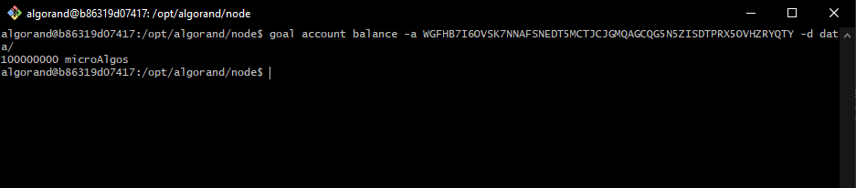
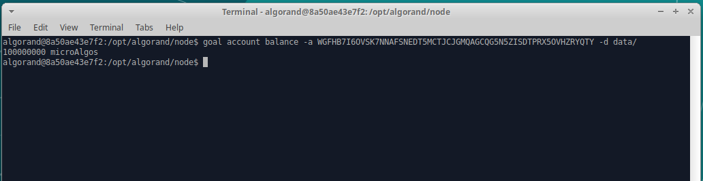

## Smart Contract

#### Creating the same Contract Account

We run two different nodes on the Algorand Testnet. Both nodes compile the same script. For this task we created two contract accounts following the instruction showed [here](https://github.com/blockchain-unica/asc1-experiments/blob/master/smart_contract/create_contract_account.md#create_contract_account).

The process of compiling the script leads to the same account address.


```
Account address: WGFHB7I6OVSK7NNAFSNEDT5MCTJCJGMQAGCQG5N5ZISDTPRX5OVHZRYQTY
```

The account generated from a Teal program cannot create or change a transaction, only approve or reject. Hence, the account balance on both machines, will reflect the same amount of Algos.

The example below shows the balance for the same contract account created by running two different nodes.




As you can see, the two nodes report the same amount of Algos.

As consequence, running the same script on two different nodes, does not change the contract account.

------